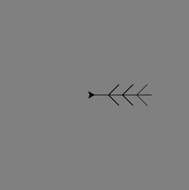

## Erstelle eine Funktion um eine Schneeflocke zu zeichnen

Deine Parallelogramm-Schneeflocke ist cool, aber sie sieht nicht so schneeflockenartig aus, wie sie könnte. Lass uns das beheben!

Für diese Zeichnung müssen wir die Turtle aus der Mitte des Fensters verschieben. Die `penup()` und `pendown()`-Anweisungen lassen uns dies tun, ohne eine Zeile zu zeichnen wie das Abheben eines echten Stiftes vom Papier und das Verschieben an einen anderen Ort, um mit dem Schreiben zu beginnen.

- Gib die folgenden Anweisungen unten in der `colours` Liste ein:
    
    ```python
    elsa.penup()
    elsa.forward(90)
    elsa.left(45)
    elsa.pendown()
    ```

Lass' uns den Code schreiben um einen Zweig der Schneeflocke zu zeichnen und sie in einer **Funktion** zu speichern. Dann kannst du es immer wieder wiederholen, um die komplette Schneeflocke zu erstellen.



- Definiere eine Funktion namens `branch` indem du folgendes schreibst:
    
    ```python
    def branch():
    ```

- Entferne den Code für die Parallelogramm - Schneeflockenschleife. Füge den folgenden Code in der `branch` - Funktion eingerückt hinzu:
    
    ```python
    for i in range(3):
        for i in range(3):
            elsa.forward(30)
            elsa.backward(30)
            elsa.right(45)
        elsa.left(90)
        elsa.backward(30)
        elsa.left(45)
    elsa.right(90)
    elsa.forward(90)
    ```
    
    **Hinweis**: Denke daran, dass Einrückung wichtig ist. Stelle sicher, dass alle deine Einrückungen korrekt sind, sonst wird dein Code nicht funktionieren!

- Schreibe einen letzten Abschnitt des Codes um die `branch`-Funktion achtmal **aufzurufen** (dies bedeutet, die Funktion auszuführen). Du kannst wie bei deiner letzten Schneeflocke wieder eine Schleife verwenden:
    
    ```python
    for i in range(8):
      branch()
      elsa.left(45)
    ```

- Setze eine `#` zu Beginn der `elsa.color(random.choice(colors))`-Anweisung, um sie in einen **Kommentar** umzuwandeln. Das bedeutet, dass der Computer diese Zeile des Codes überspringt. Du kannst die Linie löschen, aber vielleicht willst du sie später verwenden, um der Schneeflocke Farbe hinzuzufügen.

- Speichere und starte deinen Code und eine Schneeflocke sollte vor deinen Augen erscheinen!

