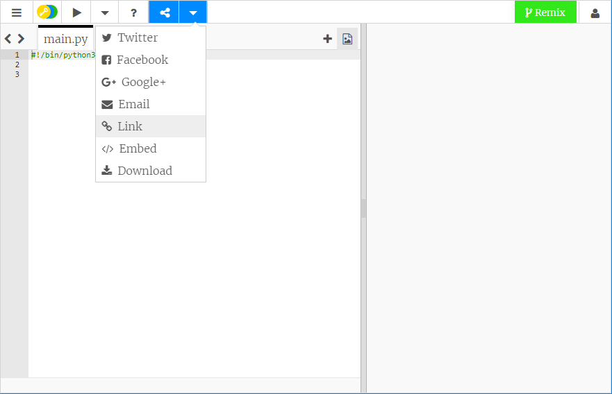

## How to draw with Python Turtle

+ Open the blank Python template trinket: <a href="http://jumpto.cc/python-new" target="_blank">jumpto.cc/python-new</a>.

+ Type the following into the window that appears:

    

    The line `#!/bin/python3` just tells Trinket that we're using Python 3 (the latest version).
    
+ To begin using Turtle in Python you need to import the Turtle library. At the top of the text editor window type `import turtle`. 
  
+ Time to give your turtle a name; you can use a variable to do this. I'm naming my turtle Elsa but you can name yours whatever you like.

  ```python
  elsa = turtle.Turtle()
  ```

+ Now you can tell your turtle what to do; for example, to move forward 100. Give it a go.

  ```python
  elsa.forward(100)
  ```
  
+ Click on **Run** to run your first turtle program. What happens?

  

__You don't need a Trinket account to save your projects!__

If you don't have a Trinket account, click the down arrow and then click **Link**. This will give you a link that you can save and come back to later. You'll need to do this every time you make changes, as the link will change!



If you have a Trinket account, you can click **Remix** to save your own copy of the trinket.

