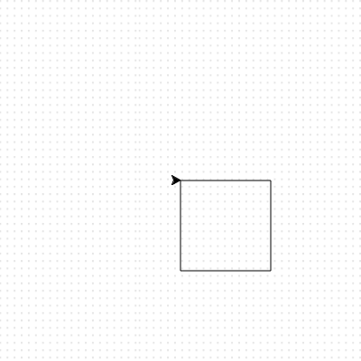

## Using loops to create shapes

To create a square, you have repeated some lines of code. This is not the most efficent way of doing it. Instead of typing out many lines of code, it's easier to use a loop.

Instead of code to create a square like this:
  
```python
elsa.forward(100)
elsa.right(90)
elsa.forward(100)
elsa.right(90)
elsa.forward(100)
elsa.right(90)
elsa.forward(100)
```

--- task ---

Use a loop to create a square.

--- code ---
---
language: python
filename: main.py
line_numbers: true
line_number_start: 1
line_highlights: 5-7
---
import turtle

elsa = turtle.Turtle()

for i in range(4):
    elsa.forward(100)
    elsa.right(90)
--- /code ---  
  
Try it yourself, and see what happens when you save and run your code.


--- /task ---
