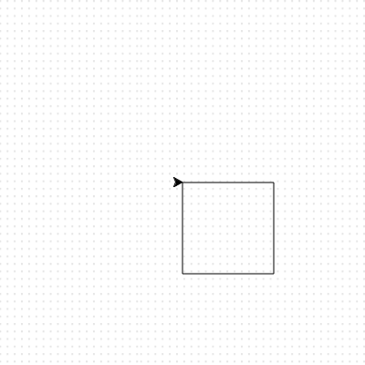

## Using loops to create shapes

To create a square, you have repeated some lines of code. It is not the most efficent way of doing it. Instead of typing out many lines of code, it makes more sense to use a loop.

Instead of code to create a square like this:
  
```python
elsa.forward(100)
elsa.right(90)
elsa.forward(100)
elsa.right(90)
elsa.forward(100)
elsa.right(90)
elsa.forward(100)
```
  
You can type:
  
```python
for i in range(4):
  elsa.forward(100)
  elsa.right(90)
```
  
Try it yourself and see what happens when you save and run your code.
  


