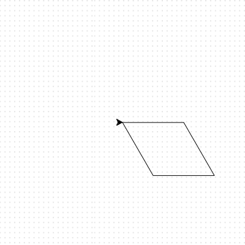
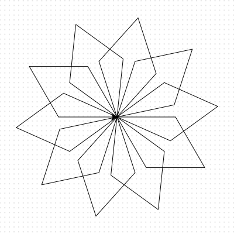

## Creating spiral patterns

Enough squares! Let's create some different shapes and repeat them to make a snowflake-like spiral.

--- task ---
Replace the code for your square with the following:

--- code ---
---
language: python
filename: main.py
line_numbers: true
line_number_start: 1
line_highlights: 5-9
---
import turtle

elsa = turtle.Turtle()

for i in range(2):
    elsa.forward(100)
    elsa.right(60)
    elsa.forward(100)
    elsa.right(120)
--- /code --- 
--- /task ---

--- task ---

 Run the code and it will draw a shape called a parallelogram.
  
 

--- /task ---

You can put loops inside of other loops. This is good news for us, as we can do this to easily make a drawing that looks like a snowflake.

--- task ---

Add another loop in the line above `for i in range(2):`. Make sure to indent the code below it.

--- code ---
---
language: python
filename: main.py
line_numbers: true
line_number_start: 1
line_highlights: 5
---
import turtle

elsa = turtle.Turtle()

for i in range(10):
    for i in range(2):
        elsa.forward(100)
        elsa.right(60)
        elsa.forward(100)
        elsa.right(120)
--- /code --- 

How many times will this loop go round?

--- /task ---
  
--- task ---

Indentation in Python is very important to ensure that your code works as you expect! Add a line to the bottom of your code so that it is inside the first `for` loop, but outside the second.

--- code ---
---
language: python
filename: main.py
line_numbers: true
line_number_start: 1
line_highlights: 5-9
---
import turtle

elsa = turtle.Turtle()

for i in range(10):
    for i in range(2):
        elsa.forward(100)
        elsa.right(60)
        elsa.forward(100)
        elsa.right(120)
    elsa.right(36)
--- /code --- 

--- /task ---

--- task ---

Save and run your code to see what happens. You should see a drawing like this:  
  

--- /task ---

  
