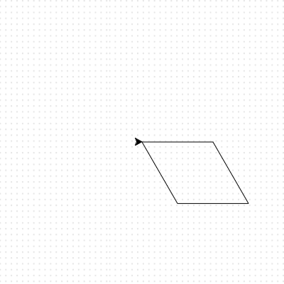
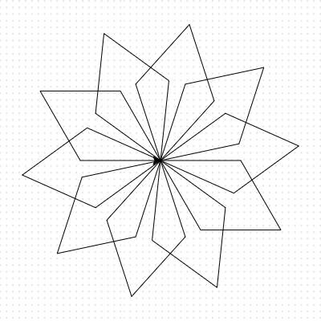

## Creating spiral patterns

Don't be a square! Let's create some different shapes and repeat them to make a snowflake-like spiral.

- Replace the code for your square with the following:

  ```python
  for i in range(2):
      elsa.forward(100)
      elsa.right(60)
      elsa.forward(100)
      elsa.right(120)
  ```
  
  It will draw a shape called a parallelogram. You can see what it looks like by saving and running your code.
  
  

- You can put loops inside of other loops. This is good news for us as we can make a drawing that looks like a snowflake. Above `for i in range(2):` type:

  ```python
  for i in range(10):
  ```
  
  How many times will this loop go round?

- Move to the bottom of your sequence of code and press the space bar four times to indent your code. Indentation in Python is very important to ensure that your code works as you expect. Then type:

  ```python
  elsa.right(36)
  ```

- Save and run your code to see what happens. You should see a drawing like this:  
  
  
  
