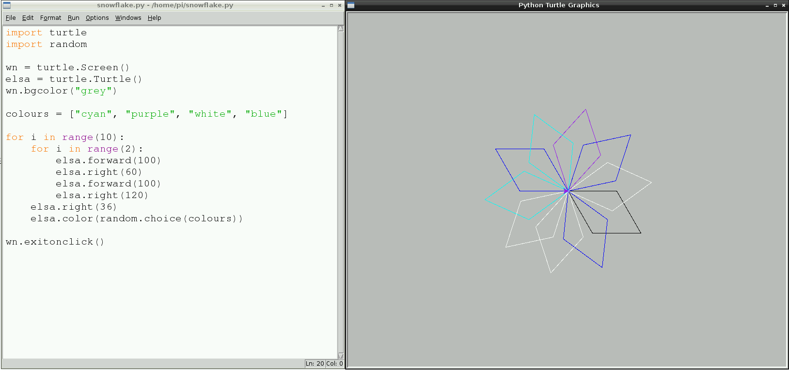

## Changing the pen colour randomly

So far the turtle has been drawing black lines on a white background. Time for some colour!

To set the colour of the turtle, use the following instruction underneath the naming of your turtle and before the loops:

```python
elsa.color("cyan")
```

*Note: The spelling of colour is different in other countries. In the US it is spelled 'color' and in Python it has to be spelled in the American way for it to work.*

I have chosen to use the colour **cyan** but you can use any from this list:

- "blue"
- "magenta"
- "grey"
- "purple"

You can also change the colour of the background window. To set the colour of the background use this instruction:

```python
turtle.Screen().bgcolor("blue")
```


For fun you can add a random colour for your turtle, so that every time you run your code you will get a slightly different result. 

- First you will need to import the `random` library. Underneath `import turtle` type `import random`.
- Next, change the background colour from `"blue"` to `"grey"`.
- Below, create a variable called `colours` to store a list of the colours to select from, like this:

  ```python
  colours = ["cyan", "purple", "white", "blue"]
  ```
  
- At the end of the spiral loop, underneath `elsa.right(36)`, type: 

  ```python
  elsa.color(random.choice(colours))  
  ```
  
- Save and run your code for a multi-coloured snowflake!



--- collapse ---

---
title: More Colors
---

There are a lot more colors to choose from, have a look at the [wiki.tcl.tk/37701](https://wiki.tcl.tk/37701) for a complete list.

--- /collapse ---