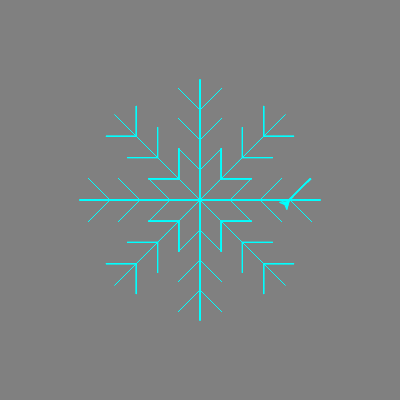

## Using a function to draw a snowflake

Your parallelogram snowflake is cool, but it does not look as snowflake-like as it could. Let's fix that!

For this drawing, we need to move the turtle from the centre of the window. The `penup()` and `pendown()` instructions let us do this without drawing a line, just like picking up a real pen from the paper and moving it somewhere else to start writing.

--- task ---

Add the following instructions below the `colours` list:

--- code ---
---
language: python
filename: main.py
line_numbers: true
line_number_start: 5
line_highlights: 7-10
---
colours = ["cyan", "purple", "white", "blue"]

elsa.penup()
elsa.forward(90)
elsa.left(45)
elsa.pendown()

elsa.color("cyan")
--- /code ---

--- /task --- 
  
Write the code to draw one branch of a snowflake, and store it inside a **function**. Then you can simply repeat it over and over to create a complete snowflake.

--- task ---

Define a function called `branch` by typing: 

--- code ---
---
language: python
filename: main.py
line_numbers: true
line_number_start: 12
line_highlights: 15
---
elsa.color("cyan")
turtle.Screen().bgcolor("grey")

def branch():
--- /code ---

--- /task ---

--- task ---

Remove the code for the parallelogram snowflake loops. Add the following code indented inside the `branch` function:

--- code ---
---
language: python
filename: main.py
line_numbers: true
line_number_start: 15
line_highlights: 16-25
---
def branch():
    for i in range(3):
        for i in range(3):
            elsa.forward(30)
            elsa.backward(30)
            elsa.right(45)
        elsa.left(90)
        elsa.backward(30)
        elsa.left(45)
    elsa.right(90)
    elsa.forward(90)
--- /code ---

--- /task ---  

  
**Note**: Remember that indentation is important. Make sure to check that all your indentation is correct, otherwise your code won't work!

--- task ---

Write a final section of code to **call** the `branch` function (which means to run it) eight times. You can use a loop again as for your last snowflake:

--- code ---
---
language: python
filename: main.py
line_numbers: true
line_number_start: 24
line_highlights: 27-29
---
    elsa.right(90)
    elsa.forward(90)

for i in range(8):
    branch()
    elsa.left(45)
--- /code ---

--- /task ---

--- task ---

Save and run your code, and a snowflake should appear before your eyes! 

--- /task ---

