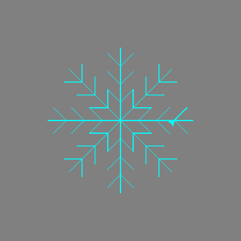

## Using a function to draw a snowflake

Your parallelogram snowflake is cool, but it does not look as snowflake-like as it could. Let's fix that!

For this drawing, we need to move the turtle from the centre of the window. The `penup()` and `pendown()` instructions let us do this without drawing a line, just like picking up a real pen from the paper and moving it somewhere else to start writing.

- Type the following instructions below the `colours` list:

  ```python
  elsa.penup()
  elsa.forward(90)
  elsa.left(45)
  elsa.pendown()
  ```
  
Let's write the code to draw one branch of a snowflake, and store it inside a **function**. Then you can simply repeat it over and over to create a complete snowflake.


- Define a function called `branch` by typing: 
 
  ```python
  def branch():
  ```
- Remove the code for the parallelogram snowflake loops. Add the following code indented inside the `branch` function:
  
  ```python
    for i in range(3):
        for i in range(3):
            elsa.forward(30)
            elsa.backward(30)
            elsa.right(45)
        elsa.left(90)
        elsa.backward(30)
        elsa.left(45)
    elsa.right(90)
    elsa.forward(90)
  ```
  
  **Note**: Remember that indentation is important. Make sure to check that all your indentation is correct, otherwise your code won't work!

- Write a final section of code to **call** the `branch` function (which means to run it) eight times. You can use a loop again as for your last snowflake:

  ```python
  for i in range(8):
      branch()
      elsa.left(45)
  ```    

- Put  a `#` at the start of the `elsa.color(random.choice(colours))` instruction to turn it into a **comment**. This means that the computer will skip that line of code. You could delete the line, but you might want to use it to add colour to your snowflake later on.

- Save and run your code, and a snowflake should appear before your eyes! 


