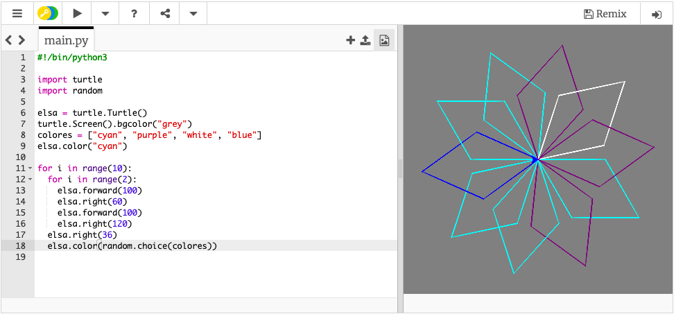

## Cambiar el color del lápiz aleatoriamente

Por ahora, la tortuga puede dibujar líneas negras sobre un fondo blanco. ¡Es hora de añadir colores!

- Para elegir el color de la tortuga, mueve el cursor por debajo de donde escribiste su nombre y antes de los bucles, y escribe lo siguiente:

```python
elsa.color("cyan")
```

**Nota**: "color" puede escribirse diferente en otros países. En Python, "color" debe escribirse igual que en el inglés estadounidense ("color").

Yo elegí el color **turquesa**, pero puedes elegir cualquiera de esta lista:

- "blue" (azul)
- "magenta"
- "grey" (gris)
- "purple" (violeta)

También puedes cambiar el color de fondo. Escribe la siguiente instrucción debajo del código que acabas de escribir:

```python
turtle.Screen().bgcolor("blue")
```


Para hacerlo más divertido, puedes agregar un color aleatorio. El color del copo de nieve cambiará cada vez que ejecutes tu código.

- Primero debes importar la biblioteca `random (aleatorio)`: debajo de `import turtle` escribe `import random`.

- A continuación, cambia el color de fondo de `"blue"` a `"grey"`.

- Debajo de esa línea, crea una variable llamada `colores` para almacenar una lista de los colores a elegir, así:
    
    ```python
    colores = ["cyan", "purple", "white", "blue"]
    ```

- Al final del bucle de espiral, debajo de `elsa.right(36)` escribe:
    
    ```python
    elsa.color(random.choice(colores))  
    ```
    
    **Note**: make sure this line is also indented, so that your program knows it's within the loop.

- Save and run your code for a multi-coloured snowflake!



## \--- collapse \---

## title: More colours

There are a lot more colours you can choose from! Have a look at [this website](https://wiki.tcl.tk/37701) for a complete list.

\--- /collapse \---