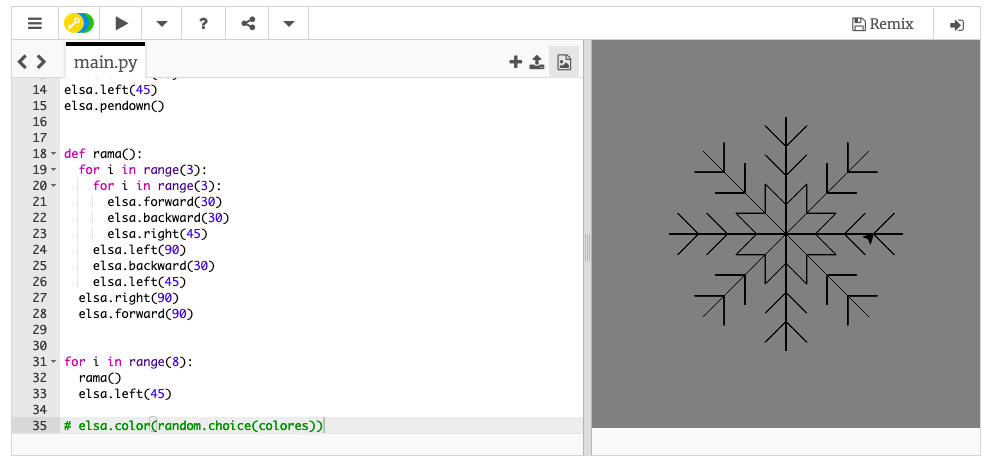

## Usar una función para dibujar un copo de nieve

Tu copo de nieve con forma de paralelogramo está genial, pero se podría ver aún mejor. ¡Vamos a arreglarlo!

Para este dibujo, necesitamos que la tortuga esté en el centro de la ventana. Las instrucciones `penup()` y `pendown()` nos permiten hacer esto sin dibujar una línea, así como normalmente haríamos levantando el lápiz para escribir en otro lugar de una hoja.

- Escribe las siguientes instrucciones debajo de la lista `colores`:
    
    ```python
    elsa.penup()
    elsa.forward(90)
    elsa.left(45)
    elsa.pendown()
    ```

Ahora escribiremos el código para dibujar un lado del copo de nieve y guardarlo dentro de una **función**. Luego, simplemente lo repites una y otra vez para crear un copo de nieve completo.


- Define una función llamada `rama` escribiendo:
    
    ```python
    def rama():
    ```

- Elimina el código del paralelogramo de los bucles del copo de nieve. Agrega el siguiente código con indentación dentro de la función `rama`:
    
    ```python
    for i in range(3):
        for i in range(3):
            elsa.forward(30)
            elsa.backward(30)
            elsa.right(45)
        elsa.left(90)
        elsa.backward(30)
        elsa.left(45)
    elsa.right(90)
    elsa.forward(90)
    ```
    
    **Nota**: Recuerda que la indentación es importante. Asegúrate de que el espacio de la indentación sea correcto, de lo contrario ¡tu código no funcionará!

- Escribe una sección final del código para **llamar **a la función `rama`, es decir, ejecutarla, ocho veces. Puedes usar un bucle tal como hicimos con copo de nieve anterior:
    
    ```python
    for i in range(8):
      rama()
      elsa.left(45)
    ```

- Agrega `#` al comienzo de la instrucción `elsa.color(random.choice(colores))` para convertirlo en un **comentario**. Esto significa que la computadora se saltará esa línea de código. Puedes borrar la línea, pero puede ser mejor guardarla para después darle color a tu copo de nieve.

- Guarda y ejecuta tu código, ¡debería aparecer un copo de nieve!

