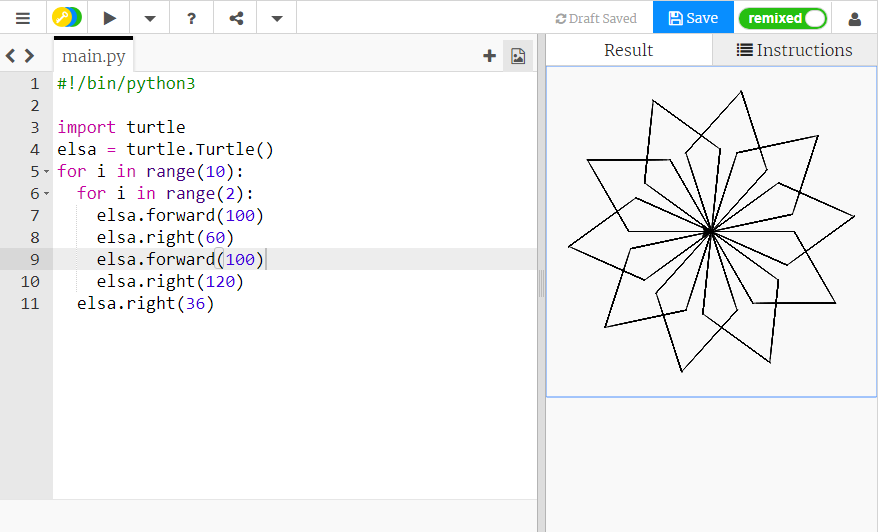

## Créer des motifs en spirale

Assez de carrés! Créons des formes différentes et répétons-les pour faire une spirale semblable à un flocon de neige.

- Remplace le code de ton carré par ce qui suit:
    
    ```python
    for i in range(2):
      elsa.forward(100)
      elsa.right(60)
      elsa.forward(100)
      elsa.right(120)
    ```
    
    Cela dessinera une forme appelée parallélogramme. Tu peux voir à quoi il ressemble en enregistrant et en exécutant ton code.
    
    

Tu peux mettre des boucles à l'intérieur d'autres boucles. C'est une bonne nouvelle pour nous, car nous pouvons le faire pour créer facilement un dessin qui ressemble à un flocon de neige.

- Au-dessus de la ligne `for i in range(2):` pour ton parallélogramme, tape:
    
    ```python
    for i in range(10):
    ```
    
    Combien de fois cette boucle tournera-t-elle?

- Déplace ton curseur à la ligne en dessous de ta séquence de code, et appuie sur la barre d'espace quatre fois pour **indenter** le code que tu es sur le point d'écrire. L'indentation en Python est très importante pour s'assurer que ton code fonctionne comme tu l'attends! Tape maintenant:
    
    ```python
    elsa.right(36)
    ```

- Enregistre et exécute ton code pour voir ce qui se passe. Tu devrais voir un dessin comme celui-ci:
    
    