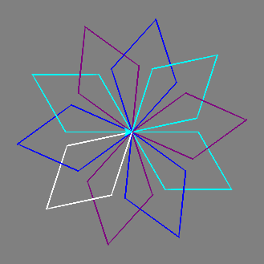

## परिचय

Python Turtle का उपयोग करके स्नोफ्लेक का एक सुंदर लैंडस्केप बनाएँ। यह बहुत मजेदार है और यह सीखना शुरू करने का एक शानदार तरीका है कि Python के साथ कोड कैसे करें।

## आप क्या बनाएँगे

कोड से डिजिटल स्नोफ्लेक, इस तरह के:

## आप क्या सीखेंगे

कोड के साथ स्नोफ्लेक्स बनाकर आप सीखेंगे कि इन्हें कैसे करें:

- रेखाएँ खींचना और Python Turtle के साथ उन्हें मोड़ना
- पेन के रंग को यादृच्छिक रूप से बदलना
- कुछ निर्देशों को दोहराने और आकार बनाने के लिए लूप का उपयोग करना
- घुमावदार पैटर्न बनाने के लिए अधिक लूप का उपयोग करना
- स्नोफ्लेक बनाने के लिए कोई फंक्शन तैयार करना

इस संसाधन में [Raspberry Pi डिजिटल निर्माण पाठ्यक्रम](https://www.raspberrypi.org/curriculum/) के निम्नलिखित तत्वों के पहलू शामिल हैं:

- [किसी समस्या को हल करने के लिए प्रोग्रामिंग संरचनाओं को जोड़ना](https://www.raspberrypi.org/curriculum/programming/builder)