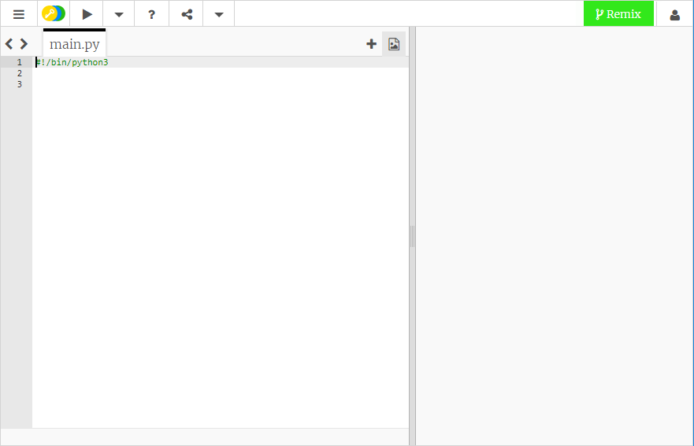
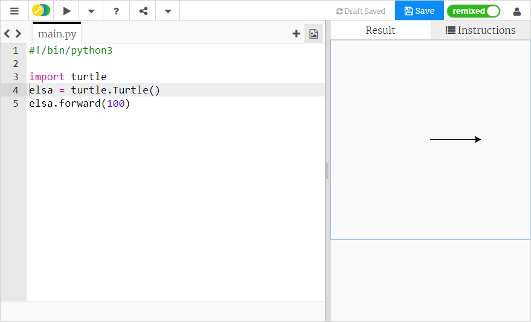
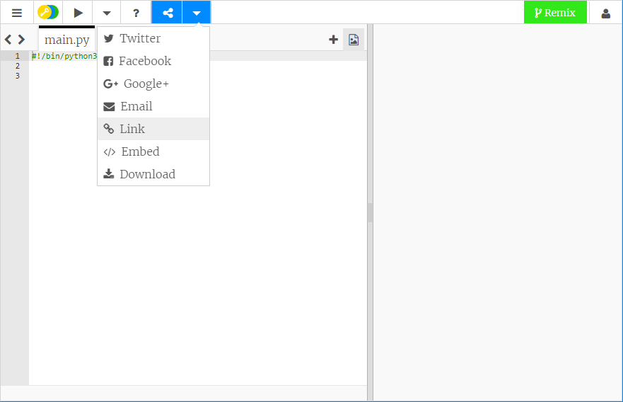

## Python Turtle से छवि कैसे बनाएँ

+ [blank Python template trinket](http://jumpto.cc/python-new) खोलें।

+ दिखाई देने वाली विंडो में निम्न टाइप करें:
    
    
    
    `#!/bin/python3` पंक्ति आपके कंप्यूटर को यह बताती है कि हम Python 3 (पायथन के नवीनतम संस्करण) का उपयोग कर रहे हैं।

+ Python में Turtle का उपयोग शुरू करने के लिए, आपको Turtle Library आयात करने की आवश्यकता है। टेक्स्ट एडिटर विंडो के शीर्ष पर, `import turtle` (टर्टल आयात करें) टाइप करें।

+ अब अपने कछुए को कोई नाम देने का समय है! इसके लिए आप किसी वेरिएबल का उपयोग कर सकते हैं। मैंने अपने कछुए का नाम `elsa` रखा है, लेकिन आप अपने कछुए को जो भी चाहें नाम दे सकते हैं।
    
    ```python
    elsa = turtle.Turtle()
    ```

+ अब आप अपने कछुए को बता सकते हैं कि क्या करना है, उदाहरण के लिए, आगे बढ़ने के लिए `100`। इसे आजमा कर देखें!
    
    ```python
    elsa.forward(100)
    ```

+ अपना पहला Turtle प्रोग्राम चलाने के लिए **Run** (चलाएँ) पर क्लिक करें। क्या होता है?
    
    

**आपको अपने प्रोजेक्ट सहेजने के लिए Trinket खाते की आवश्यकता नहीं है!**

यदि आपके पास Trinket खाता नहीं है, तो नीचे के तीर पर क्लिक करें और फिर **Link** (लिंक) पर क्लिक करें। इससेआपको एक लिंक मिलेगा जिसे आप सहेज सकते हैं और बाद में वापस आ सकते हैं। बस याद रखें कि जब भी आप अपने कोड में बदलाव करते हैं, तो आपको इसे हर बार करने की आवश्यकता होगी, क्योंकि लिंक बदल जाएगा!



यदि आपके पास Trinket खाता है, तो आप Trinket की अपनी प्रति सहेजने के लिए **Remix** (रीमिक्स) पर क्लिक कर सकते हैं।