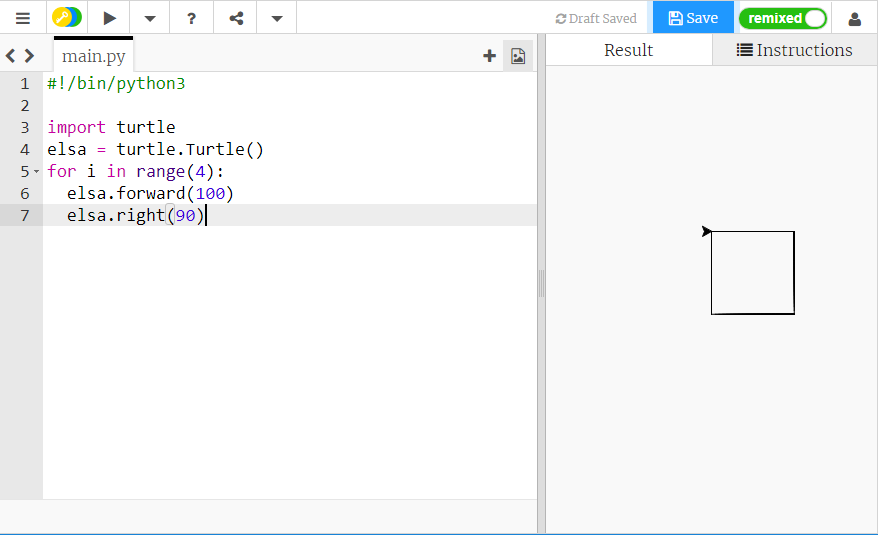

## आकार बनाने के लिए लूप का उपयोग करना

एक चौकोर बनाने के लिए, आपने कोड की कुछ पंक्तियों को दोहराया है। इसे करने का यह बहुत अधिक प्रभावशाली तरीका नहीं है। कोड की कई पंक्तियों को टाइप करने के बजाय, लूप का उपयोग करना अधिकआसान है।

चौकोर बनाने के लिए इस तरह के कोड के बजाय:

```python
elsa.forward(100)
elsa.right(90)
elsa.forward(100)
elsa.right(90)
elsa.forward(100)
elsa.right(90)
elsa.forward(100)
```

आप लिख सकते हैं:

```python
for i in range(4):
  elsa.forward(100)
  elsa.right(90)
```

इसे स्वयं आजमाएँ, और देखें कि जब आप अपना कोड सहेजते हैं और चलाते हैं तो क्या होता है।

