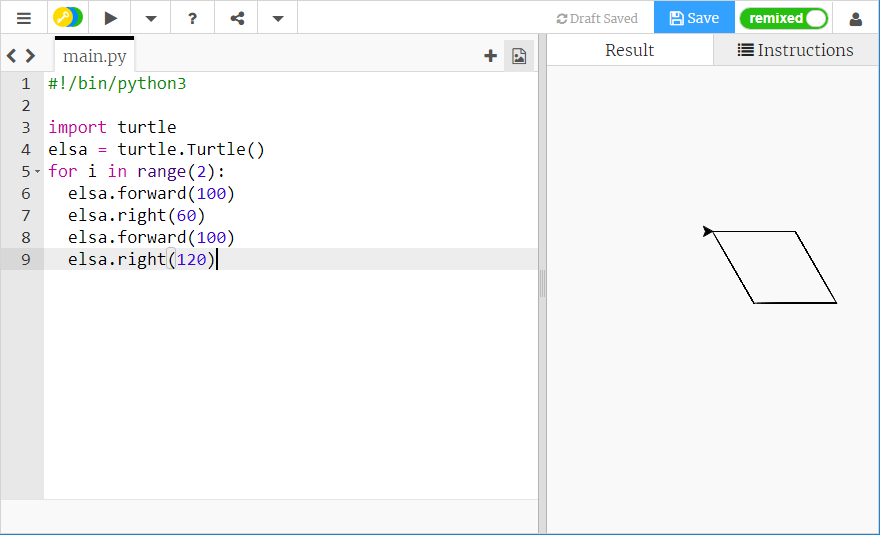
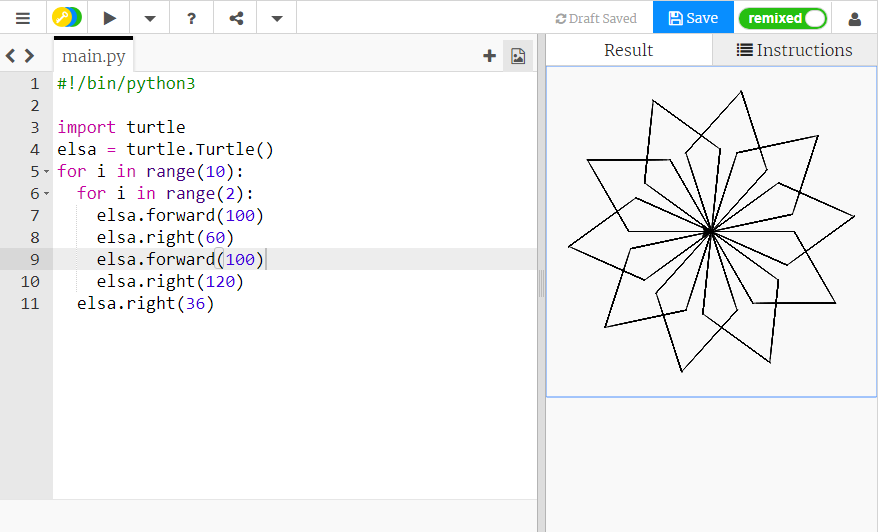

## घुमावदार पैटर्न बनाना

पर्याप्त चौकोर! आइए कुछ अलग आकृतियाँ बनाएँ और स्नोफ्लेक जैसी घुमावदारआकृति बनाने के लिए उन्हें दोहराएँ।

- निम्नलिखित के साथ अपने चौकोर के लिए कोड बदलें:
    
    ```python
    for i in range(2):
      elsa.forward(100)
      elsa.right(60)
      elsa.forward(100)
      elsa.right(120)
    ```
    
    इससे समानांतर चतुर्भुज नामक एक आकृति बनेगी। अपने कोड को सहेजकर और चलाकर आप देख सकते हैं कि यह कैसी दिखती है।
    
    

आप अन्य लूपों के अंदर लूप रख सकते हैं। यह हमारे लिए अच्छी खबर है, क्योंकि हम स्नोफ्लेक की तरह दिखने वाले चित्र को आसानी से बनाने के लिए ऐसा कर सकते हैं।

- अपने समानांतर चतुर्भुज के लिए, `for i in range(2):` (रेंज(2) में i के लिए) पंक्ति के ऊपर, टाइप करें:
    
    ```python
    for i in range(10):
    ```
    
    यह लूप कितनी बार घूमेगा?

- अपने कर्सर को अपने कोड के अनुक्रम के नीचे की पंक्ति पर ले जाएँ, और जिस कोड को आप लिखने जा रहे हैं उसे **इंडेंट** करने के लिए स्पेस बार को चार बार दबाएँ। Python में इंडेंट करना यह सुनिश्चित करने के लिए बहुत महत्वपूर्ण है कि आपका कोड आपकी उम्मीद के अनुसार काम करता है! अब टाइप करें:
    
    ```python
    elsa.right(36)
    ```

- क्या होता है यह देखने के लिए अपना कोड सहेजें और चलाएँ। आपको इस तरह एक चित्र दिखाई देना चाहिए:
    
    