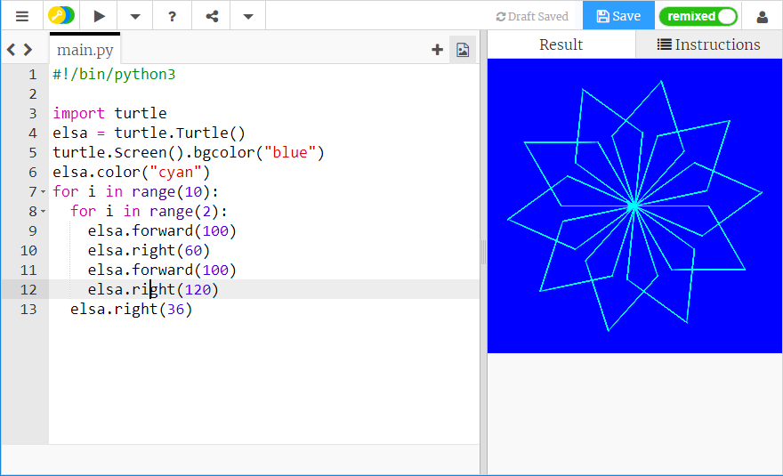
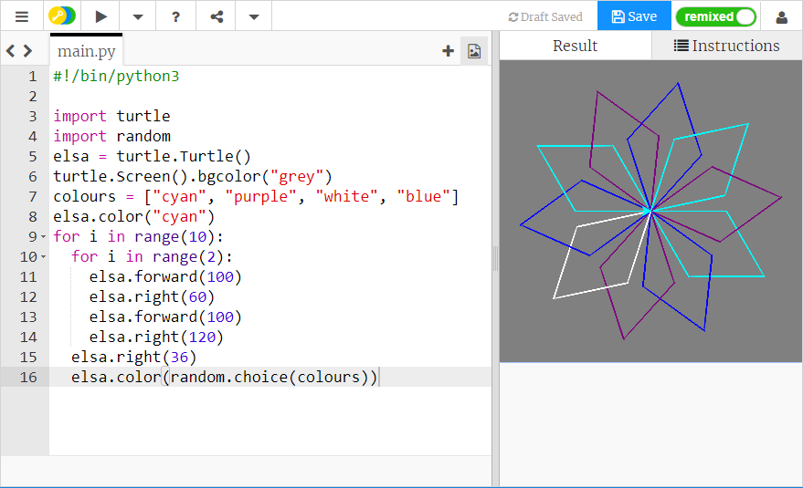

## पेन के रंग को यादृच्छिक रूप से बदलना

अभी तक कछुआ सफेद पृष्ठभूमि पर काली रेखाएँ खींच कर रहा है। अब रंग जोड़ने का समय आ गया है!

- कछुए के रंग को सेट करने के लिए, अपने कर्सर को नीचे अपने लूप से पहले और उस जगह ले जाएँ जहाँ आपने अपने कछुए को नाम दिया था, और निम्नलिखित टाइप करें:

```python
elsa.color("cyan")
```

**ध्यान दें**: अन्य देशों में 'colour' (रंग) की वर्तनी अलग है। अमेरिका में, इसकी वर्तनी 'color' होती है, और Python में काम करने के लिए इसकी वर्तनी अमेरिकी तरीके से रखी जानी होती है।

मैंने **सियान** रंग का उपयोग करना चुना है, लेकिन आप इस सूची से किसी रंग का भी उपयोग कर सकते हैं:

- "नीला"
- "मैजेंटा"
- "ग्रे" (भूरा)
- "बैंगनी"

आप पृष्ठभूमि विंडो का रंग भी बदल सकते हैं। पृष्ठभूमि का रंग सेट करने के लिए, आपनेअभी-अभी जो कोड लिखा है उसके नीचे दिए गए इस निर्देश का उपयोग करें:

```python
turtle.Screen().bgcolor("blue")
```



मज़े के लिए आप अपने कछुए के लिए कोई यादृच्छिक रंग जोड़ सकते हैं, ताकि हर बार जब आप अपना कोड चलाएँगे, तो आपको थोड़ा अलग स्नोफ्लेक मिलेगा।

- सबसे पहले आपको `random` (यादृच्छिक) लाइब्रेरी आयात करने की आवश्यकता होगी: `import turtle` (टर्टल आयात करें) के नीचे, `import random` (यादृच्छिक आयात करें) टाइप करें।

- इसके बाद, पृष्ठभूमि रंग को `"blue"` (नीला) से बदलकर `"grey"` (भूरा) कर दें।

- उस पंक्ति के नीचे, रंगों को चुनने के लिए रंगों की सूची को संगृहीत करने के लिए, `colours` (रंग) नामक एक वेरिएबल बनाएँ, इस तरह:
    
    ```python
    colours = ["cyan", "purple", "white", "blue"]
    ```

- घुमावदार लूप के अंत में, `elsa.right(36)` के नीचे, लिखें:
    
    ```python
    elsa.color(random.choice(colours))  
    ```
    
    **नोट**: सुनिश्चित करें कि इस पंक्ति को भी इंडेंट किया जाता है, ताकि आपके प्रोग्राम को पता हो कि यह लूप के भीतर है।

- बहु-रंगीय स्नोफ्लेक के लिए अपने कोड को सहेजें और चलाएँ!



--- collapse ---
---
title: अधिक रंग
---

आप और बहुत से रंगों में से चुन सकते हैं! पूरी सूची के लिए [this website](https://wiki.tcl.tk/37701) (इस वेबसाइट) पर एक नज़र डालें।

--- /collapse ---