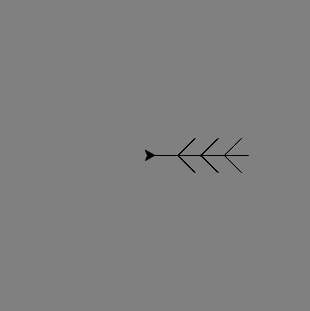
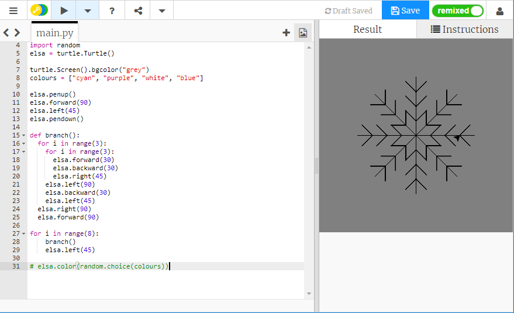

## स्नोफ्लेक बनाने के लिए एक फंक्शन का उपयोग करना

आपका समानांतर चतुर्भुज स्नोफ्लेक बढ़िया है, लेकिन यह स्नोफ्लेक जैसा उतना नहीं दिखता है जितना यह हो सकता था। आइए इसे ठीक करें!

इस चित्र के लिए, हमें कछुए को विंडो के मध्य से दूसरी जगह ले जाने की आवश्यकता है। `penup()` और `pendown()` निर्देशों से हम कोई रेखा खींचे बिना ऐसा कर सकते हैं, ठीक वैसे ही जैसे पेपर से किसी असली पैन को उठाना और लिखना शुरू करने के लिए उसे कहीं और ले जाना।

- `colours` (रंग) सूची के नीचे निम्नलिखित निर्देश टाइप करें:
    
    ```python
    elsa.penup()
    elsa.forward(90)
    elsa.left(45)
    elsa.pendown()
    ```

आइए स्नोफ्लेक की एक शाखा बनाने के लिए कोड लिखें, और उसे किसी **फंक्शन** के भीतर संगृहीत करें। फिर आप एक पूरा स्नोफ्लेक बनाने के लिए इसे बार-बार दोहरा सकते हैं।



- निम्नलिखित टाइप करके `branch` (शाखा) नामक फ़ंक्शन को परिभाषित करें:
    
    ```python
    def branch():
    ```

- समांतर चतुर्भुज स्नोफ्लेक लूप के लिए कोड निकालें। `branch` (शाखा) के भीतर इंडेंट किए गए निम्नलिखित कोड को जोड़ें:
    
    ```python
    for i in range(3):
        for i in range(3):
            elsa.forward(30)
            elsa.backward(30)
            elsa.right(45)
        elsa.left(90)
        elsa.backward(30)
        elsa.left(45)
    elsa.right(90)
    elsa.forward(90)
    ```
    
    **नोट**: याद रखें कि इंडेंट करना महत्वपूर्ण है। यह जाँच करना सुनिश्चित करें कि आपके सभी इंडेंटेशन सही हैं, अन्यथा आपका कोड काम नहीं करेगा!

- `branch` (शाखा) फंक्शन को **call** (कॉल) करने के लिए कोड का अंतिम खंड लिखें (जिसका मतलब है इसे चलाना) आठ बार। आप अपने अंतिम स्नोफ्लेक के लिए फिर से एक लूप का उपयोग कर सकते हैं:
    
    ```python
    for i in range(8):
      branch()
      elsa.left(45)
    ```

- `elsa.color(random.choice(colours))` (यादृच्छिक चयन (रंग)) निर्देश के आरंभ में एक `#` रखें ताकि उसे **comment** (टिप्पणी) के रूप में बदला जा सके। इसका मतलब है कि कंप्यूटर कोड की उस पंक्ति को छोड़ देगा। आप इस पंक्ति को हटा सकते हैं, लेकिन हो सकता है कि आप बाद में अपने स्नोफ्लेक में रंग जोड़ने के लिए इसका उपयोग करना चाहें।

- अपना कोड सहेजें और चलाएँ, और आपकी आंखों के सामने एक स्नोफ्लेक दिखना चाहिए!

