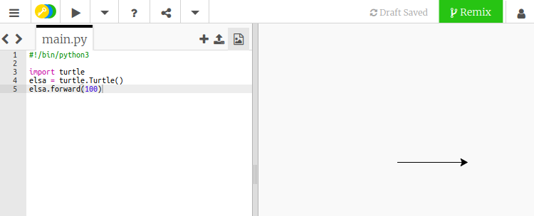

## Come disegnare con Python Turtle

+ Apri il [template Python vuoto su trinket](http://jumpto.cc/python-new).

+ Scrivi il seguente testo nella finestra che compare:
    
    
    
    La riga `#!/bin/python3` dice al tuo computer che stiamo usando Python 3 (l'ultima versione di Python).

+ Per iniziare a usare Turtle in Python, devi importare la libreria Turtle. Nella parte superiore della finestra dell'editor di testo, digitare `import turtle`.

+ È ora di dare un nome alla tua tartaruga! Per farlo è possibile utilizzare una variabile. Io chiamerò la mia tartaruga `elsa`, ma tu puoi nominare la tua come preferisci.
    
    ```python
    elsa = turtle.Turtle()
    ```

+ Ora puoi dire alla tua tartaruga cosa fare, ad esempio, di avanzare `100`. Provaci!
    
    ```python
    elsa.forward(100)
    ```

+ Fai clic su **Run** per eseguire il tuo primo programma Turtle. Cosa succede?
    
    

**Non hai bisogno di un account Trinket per salvare i tuoi progetti!**

Se non hai un account Trinket, fai click sulla freccia che punta verso il basso e clicca su **Link**. Questo comando ti darà un link che puoi salvare e che potrai aprire nuovamente più tardi. Ricorda solo che dovrai farlo ogni volta che modifichi il tuo codice, poiché il collegamento cambierà!


Se hai un account Trinket, puoi cliccare su **Remix** per salvare la tua copia del trinket.