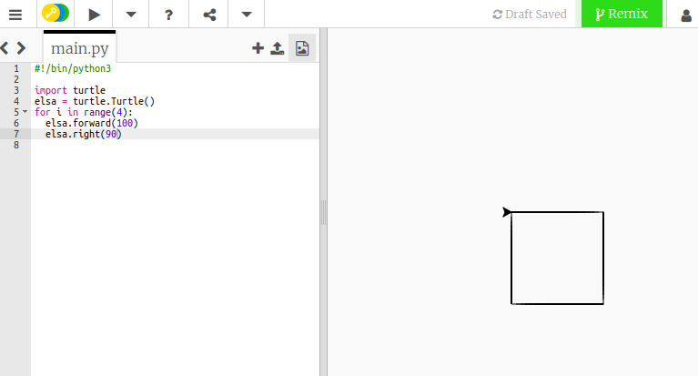

## Usare i cicli per creare forme

Per creare un quadrato, hai ripetuto alcune righe di codice. Questo non è il modo più efficiente di farlo. Invece di digitare molte righe di codice, è più facile usare un ciclo.

Invece del codice per creare un quadrato come questo:

```python
elsa.forward(100)
elsa.right(90)
elsa.forward(100)
elsa.right(90)
elsa.forward(100)
elsa.right(90)
elsa.forward(100)
```

Puoi digitare:

```python
for i in range(4):
  elsa.forward(100)
  elsa.right(90)
```

Provalo tu stesso e vedi cosa succede quando salvi ed esegui il tuo codice.

