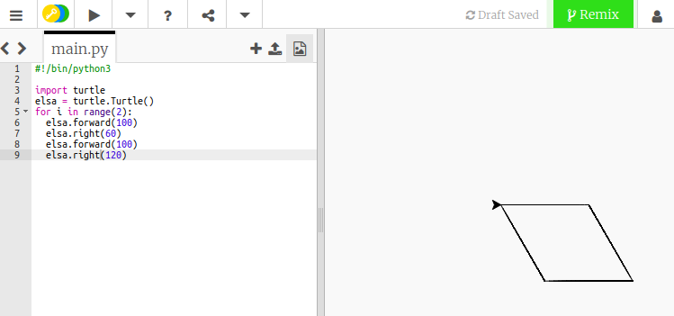
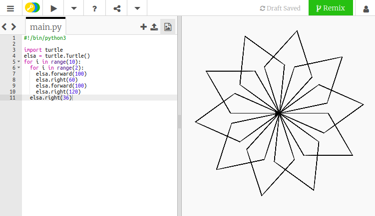

## Creazione modelli a spirale

Abbastanza quadrati! Creiamo alcune forme diverse e ripetiamole per creare una spirale simile a un fiocco di neve.

- Sostituisci il codice per il tuo quadrato con il seguente:
    
    ```python
    for i in range(2):
      elsa.forward(100)
      elsa.right(60)
      elsa.forward(100)
      elsa.right(120)
    ```
    
    Questo disegnerà una forma chiamata parallelogramma. Puoi vedere come appare salvando ed eseguendo il tuo codice.
    
    

Puoi inserire dei cicli all'interno di altri cicli. Questa è una buona notizia per noi, poiché possiamo usarlo per realizzare facilmente un disegno che assomigli a un fiocco di neve.

- Sopra la riga `for i in range(2):` per il tuo parallelogramma, digita:
    
    ```python
    for i in range(10):
    ```
    
    Quante volte questo ciclo verrà eseguito?

- Sposta il cursore sulla riga sotto la sequenza di codice, e premi la barra spaziatrice quattro volte per **indentare** il codice che stai per scrivere. Gli spazi in Python sono molto importanti per garantire che il tuo codice funzioni come ti aspetti! Ora digita:
    
    ```python
    elsa.right(36)
    ```

- Salva ed esegui il tuo codice per vedere cosa succede. Dovresti vedere un disegno come il seguente:
    
    