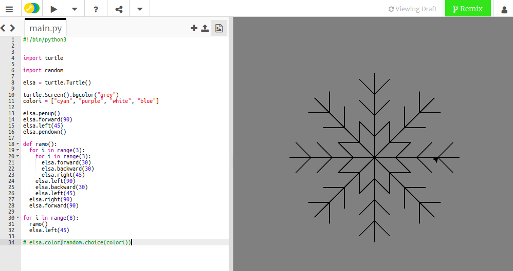

## Usare una funzione per disegnare un fiocco di neve

Il tuo fiocco di neve a parallelogramma è bello, ma non assomiglia molto a un fiocco di neve. Sistemiamolo!

Per questo disegno, dobbiamo spostare la tartaruga dal centro della finestra. Le istruzioni `penup()` e `pendown()` ci permettono di disegnare una linea, proprio come sollevare una vera penna dal foglio e spostarla da qualche altra parte per iniziare a scrivere.

- Digitare le seguenti istruzioni sotto la lista `colori`:
    
    ```python
    elsa.penup()
    elsa.forward(90)
    elsa.left(45)
    elsa.pendown()
    ```

Scriviamo il codice per disegnare un ramo di un fiocco di neve, e memorizzalo all'interno di una **funzione**. A questo punto lo si potrà semplicemente ripetere più e più volte per creare un fiocco di neve completo.


- Definisci una funzione chiamata `ramo` digitando:
    
    ```python
    def ramo():
    ```

- Cancella il codice dei cicli del fiocco di neve a parallelogramma. Aggiungi il seguente codice rientrato all'interno della funzione `ramo`:
    
    ```python
    for i in range(3):
        for i in range(3):
            elsa.forward(30)
            elsa.backward(30)
            elsa.right(45)
        elsa.left(90)
        elsa.backward(30)
        elsa.left(45)
    elsa.right(90)
    elsa.forward(90)
    ```
    
    **Nota**: Ricorda che il rientro è importante. Assicurati di controllare che il rientro sia corretto, altrimenti il tuo codice non funzionerà!

- Scrivi una sezione finale di codice per **richiamare** la funzione `ramo` che verrà eseguita otto volte. Puoi usare di nuovo un ciclo come per il fiocco di neve:
    
    ```python
    for i in range(8):
      ramo()
      elsa.left(45)
    ```

- Inserisci un `#` all'inizio dell'istruzione `elsa.color(random.choice (colori))` per trasformarlo in un **commento**. Ciò significa che il computer salterà quella riga di codice, non eseguendola. Puoi cancellare la linea ma, più tardi, potresti volerla usare per aggiungere colore al tuo fiocco di neve.

- Salva ed esegui il tuo codice e un fiocco di neve dovrebbe apparire davanti ai tuoi occhi!

