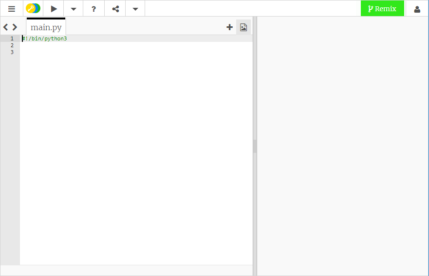

## Python 터틀 그래픽으로 그리는 방법

+ [빈 Python trinket 템플릿](http://jumpto.cc/python-new)을 여세요.

+ 나타나는 창에 다음을 입력 해 보세요.
    
    
    
    `#!/bin/python3`이라는 Code는 우리가 Python 3(Python의 가장 최신 버전) 을 사용하고 있다는 것을 알려줍니다.

+ Python에서 터틀 그래픽을 사용하기 위해서 터틀 라이브러리를 불러와야 합니다. 텍스트 편집기 창 상단에 `import turtle`을 입력하세요.

+ 이제 거북이에 이름을 지어줄 시간입니다! 변수를 사용해서 이름을 지을 수 있습니다. 저는 제 거북이 이름을 `엘사`라고 지었지만 여러분이 원하는 이름으로 지어도 됩니다.
    
    ```python
    elsa = turtle.Turtle()
    ```

+ 이제 거북이에게 명령을 시킬 수 있습니다. 예를 들어, 앞으로 `100`만큼 가도록 시킬 수 있습니다. 한번 써보세요!
    
    ```python
    elsa.forward(100)
    ```

+ 여러분의 첫번째 터틀 프로그램을 실행하려면 **Run**을 클릭하세요. 어떤 일이 일어나나요?
    
    

**프로젝트를 저장하기 위해 Trinket 계정이 필요하지 않습니다!**

Trinket 계정이 없다면 아래쪽 화살표를 클릭 한 다음 **링크**를 클릭하십시오. 이 링크로 진행 중인 프로젝트를 계속 진행할 수 있습니다. 코드를 수정하면 링크도 바뀌기 때문에 이 작업을 매번 해야한다는 것을 기억하세요!


Trinket 계정이 있다면, **Remix**를 클릭해서 복사본을 Trinket에 저장할 수 있습니다.