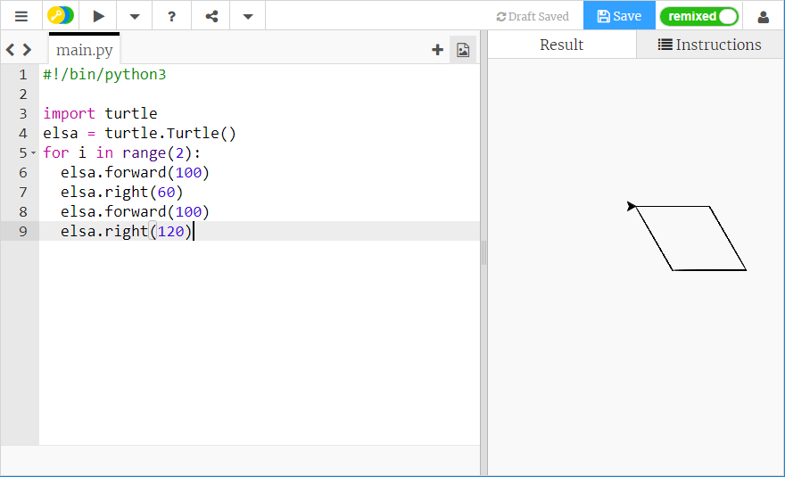

## Spiraalpatronen creëren

Genoeg vierkanten! Laten we een paar verschillende vormen maken en ze herhalen om een sneeuwvlokachtige spiraal te maken.

- Vervang de code voor je vierkant door het volgende:
    
    ```python
    for i in range(2):
      elsa.forward(100)
      elsa.right(60)
      elsa.forward(100)
      elsa.right(120)
    ```
    
    Hiermee wordt een vorm getekend die een parallellogram wordt genoemd. Je kunt zien hoe het eruit ziet door je code op te slaan en uit te voeren.
    
    

Je kunt lussen binnen andere lussen plaatsen. Dit is goed nieuws voor ons, omdat we dit kunnen doen om gemakkelijk een tekening te maken die op een sneeuwvlok lijkt.

- Boven de regel `for i in range(2):` voor je parallellogram, typ:
    
    ```python
    for i in range(10):
    ```
    
    Hoe vaak gaat deze lus rond?

- Verplaats je cursor naar de regel onder je blok code en druk vier keer op de spatiebalk om de code die je gaat schrijven **in te springen**. Inspringen in Python is erg belangrijk om ervoor te zorgen dat je code werkt zoals je verwacht! Typ nu:
    
    ```python
    elsa.right(36)
    ```

- Sla je code op en voer deze uit om te zien wat er gebeurt. Je zou een tekening als volgt moeten zien:
    
    