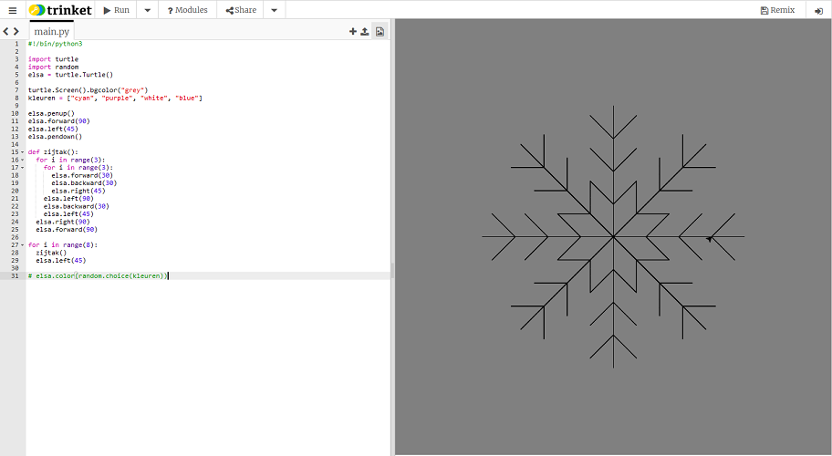

## Een functie gebruiken om een sneeuwvlok te tekenen

Je parallellogram-sneeuwvlok is cool, maar ziet er niet zo sneeuwvlokachtig uit als zou kunnen. Daar gaan we iets aan doen!

Voor deze tekening moeten we de schildpad vanuit het midden van het venster verplaatsen. De `penup()` en `pendown()` instructies laten ons dit doen zonder een lijn te tekenen. Net als een echte pen ophalen van het papier en hem elders verplaatsen om te beginnen met schrijven.

- Typ de volgende instructies onder de `kleuren` lijst:
    
    ```python
    elsa.penup()
    elsa.forward(90)
    elsa.left(45)
    elsa.pendown()
    ```

Laten we de code schrijven om een zijtak van een sneeuwvlok te tekenen en deze op te slaan in een **functie**. Dan kun je het gewoon herhalen om een complete sneeuwvlok te maken.


- Definieer een functie met de naam `zijtak` door te typen:
    
    ```python
    def zijtak():
    ```

- Verwijder de code voor de parallellogram-sneeuwvloklussen. Voeg de volgende ingesprongen code toe binnen de `zijtak`-functie:
    
    ```python
    for i in range(3):
        for i in range(3):
            elsa.forward(30)
            elsa.backward(30)
            elsa.right(45)
        elsa.left(90)
        elsa.backward(30)
        elsa.left(45)
    elsa.right(90)
    elsa.forward(90)
    ```
    
    **Opmerking**: Onthoud dat inspringen belangrijk is. Zorg ervoor dat je controleert of al je inspringing correct is, anders werkt je code niet!

- Schrijf een laatste stukje code om acht keer een **aanroep** te doen van de `zijtak`-functie (wat betekent dat die moet worden uitgevoerd). Je kunt opnieuw een lus gebruiken zoals voor je laatste sneeuwvlok:
    
    ```python
    for i in range(8):
      zijtak()
      elsa.left(45)
    ```

- Zet een `#` aan het begin van de `elsa.color(random.choice(kleuren))` instructie om er een **opmerking** van te maken. Dit betekent dat de computer die regel code overslaat. Je kunt de regel verwijderen, maar je wilt deze misschien later gebruiken om kleur toe te voegen aan je sneeuwvlok.

- Sla je code op en voer uit en er zou een sneeuwvlok voor je ogen moeten verschijnen!

