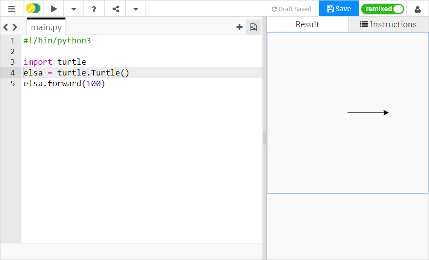

## Como desenhar com Python Turtle

+ Abra o [modelo em branco de Python no trinket](http://jumpto.cc/python-new).

+ Digite o seguinte na janela que aparece:
    
    
    
    A linha `#!/bin/python3` só diz ao seu computador que estamos usando Python 3 (a última versão de Python).

+ Para começar a usar o Turtle em Python, você precisa importar a biblioteca Turtle. No topo da janela do editor de texto, digite `import turtle`.

+ Hora de dar um nome à sua tartaruga! Você pode usar uma variável para fazer isso. Estou chamando minha tartaruga `elsa`, mas você pode dar o nome que quiser para a sua.
    
    ```python
    elsa = turtle.Turtle()
    ```

+ Agora você pode dizer à sua tartaruga o que fazer, por exemplo, para avançar `100`. Experimente!
    
    ```python
    elsa.forward(100)
    ```

+ Clique em **Run** para executar o seu primeiro programa usando Turtle. O que acontece?
    
    

**Você não precisa de uma conta no Trinket para salvar seus projetos!**

Se você não tiver uma conta no Trinket, clique na seta para baixo e, em seguida, clique em **Link**. Isso lhe dará um link que você pode salvar e voltar mais tarde. Apenas lembre-se de que você precisará fazer isso toda vez que fizer alterações no seu código, pois o link mudará!


Se você tem uma conta no Trinket, você pode clicar em **Remix** para salvar sua própria cópia do trinket.