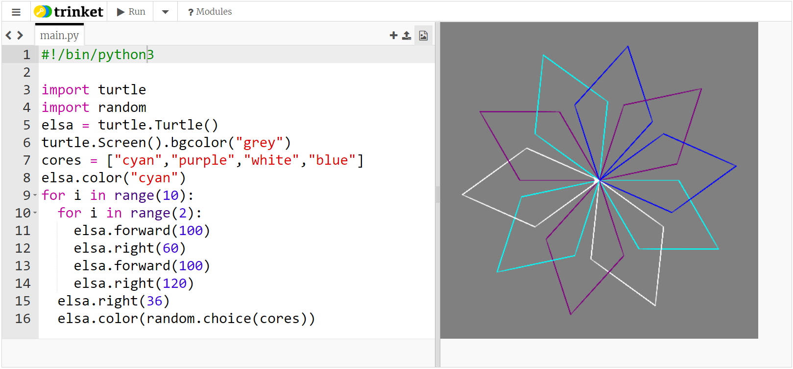

## Mudando a cor da caneta aleatoriamente

Até agora, a tartaruga tem desenhado linhas pretas em fundos brancos. Agora é hora de adicionar cor!

- Para definir a cor da tartaruga, mova o cursor abaixo de onde você escreveu o nome da sua tartaruga e antes dos laços, e digite o seguinte:

```python
elsa.color("cyan")
```

**Nota**: A palavra 'cor' se escreve diferente em outros países. Nos EUA se escreve 'color' e em Python tem de ser escrita da maneira americana pra funcionar.

Optei por usar a cor **cyan**, mas você pode usar qualquer uma desta lista:

- "blue"
- "magenta"
- "grey"
- "purple"

Você também pode alterar a cor da janela de fundo. Para definir a cor do fundo, use esta instrução abaixo do código que você acabou de escrever:

```python
turtle.Screen().bgcolor("blue")
```


Por diversão você pode adicionar uma cor aleatória para sua tartaruga, assim cada vez que você executar seu código, você terá um floco de neve um pouco diferente.

- Primeiro, você precisará importar a biblioteca `random`: abaixo de `import turtle`, digite `import random`.

- Em seguida, altere a cor de fundo de `"blue"` para `"grey"`.

- Abaixo dessa linha, crie uma variável chamada `cores` para armazenar uma lista das cores a serem selecionadas, assim:
    
    ```python
    cores = ["cyan", "purple", "white", "blue"]
    ```

- No final do laço espiral, abaixo de `elsa.right(36)`, digite:
    
    ```python
    elsa.color(random.choice(cores))  
    ```
    
    **Nota**: certifique-se de que esta linha também seja indentada, para que seu programa saiba que está dentro do laço.

- Salve e execute seu código para um floco de neve multicolorido!



## \--- collapse \---

## title: Mais cores

Há muito mais cores que você pode escolher! Dê uma olhada [neste site](https://wiki.tcl.tk/37701) para obter uma lista completa.

\--- /collapse \---