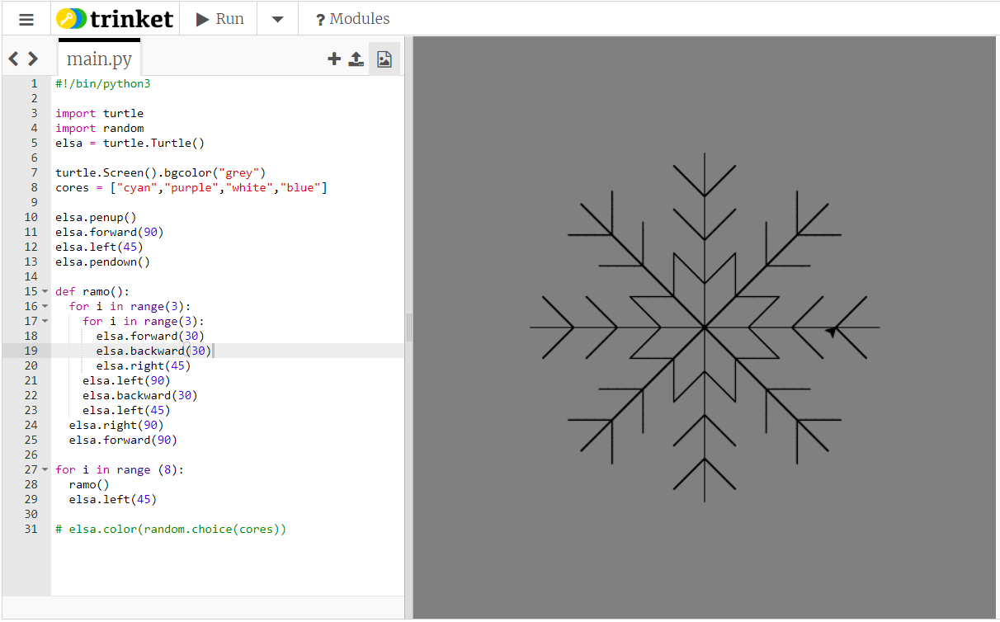

## Usando uma função para desenhar um floco de neve

Seu floco de neve paralelogramo é legal, mas não se parece tanto com um floco de neve como poderia. Vamos consertar isso!

Para este desenho, precisamos mover a tartaruga do centro da janela. As instruções `penup()` e `pendown()` nos permitem fazer isso sem desenhar uma linha, assim como pegar uma caneta de verdade do papel e movê-la para outro lugar para começar a escrever.

- Digite as seguintes instruções abaixo da lista `cores`:
    
    ```python
    elsa.penup()
    elsa.forward(90)
    elsa.left(45)
    elsa.pendown()
    ```

Vamos escrever o código para desenhar um ramo de um floco de neve e armazená-lo dentro de uma **função**. Então você pode simplesmente repetir isso várias vezes para criar um floco de neve completo.


- Defina uma função chamada `ramo` digitando:
    
    ```python
    def ramo():
    ```

- Remova o código para os laços do floco de neve paralelogramo. Adicione o seguinte código indentado dentro da função `ramo`:
    
    ```python
    for i in range(3):
        for i in range(3):
            elsa.forward(30)
            elsa.backward(30)
            elsa.right(45)
        elsa.left(90)
        elsa.backward(30)
        elsa.left(45)
    elsa.right(90)
    elsa.forward(90)
    ```
    
    **Nota**: Lembre-se de que a indentação é importante. Certifique-se de verificar se toda a sua indentação está correta, caso contrário, seu código não funcionará!

- Escreva uma seção final do código para **chamar** a função `ramo` (que significa executá-lo) oito vezes. Você pode usar um laço novamente como no seu último floco de neve:
    
    ```python
    for i in range(8):
      ramo()
      elsa.left(45)
    ```

- Coloque um `#` no início da instrução `elsa.color(random.choice(cores))` para transformá-la em um **comentário**. Isto significa que o computador irá pular essa linha de código. Você pode excluir a linha, mas talvez você queira usá-la para adicionar cor ao seu floco de neve mais tarde.

- Salve e execute seu código, e um floco de neve deve aparecer diante de seus olhos!

