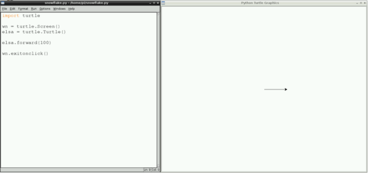
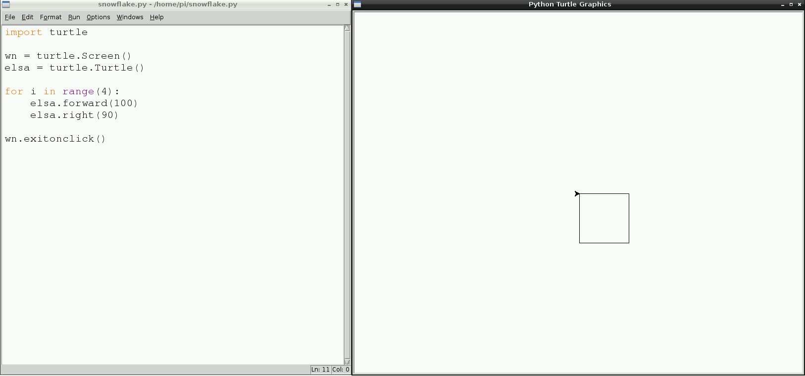
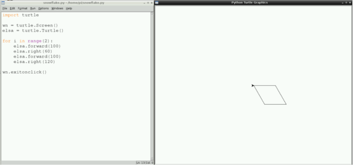
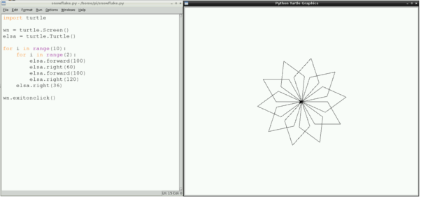
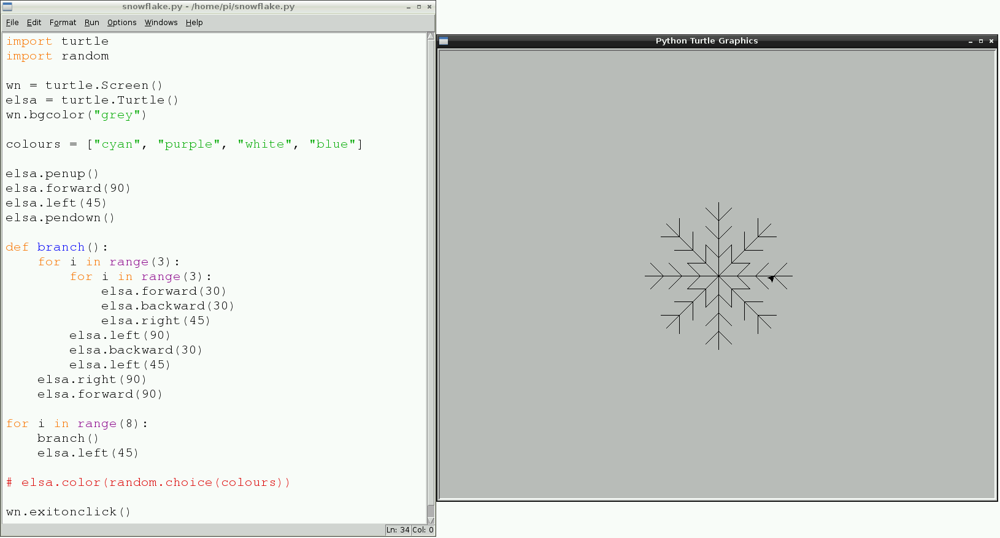

# Draw a snowflake with code

## How to draw with Python Turtle

1. To begin, you will need to open the Python 3 programming environment **IDLE3**. You can do this by selecting it from the **Main Menu** with your mouse. 
1. Then click on **File** and **New Window** to open a blank text editor window to write your code in. 
1. Save your empty file by clicking on **File**, **Save As** and naming it `snowflake.py`.
1. To begin using Turtle in Python you need to import the Turtle library. At the top of the text editor window type `import turtle`. 
1. Next, a command is needed to create the window which will display your turtle drawings: `turtle.Screen()`. To save having to type it out every time you need the command, you can store it as a **variable**:

  ```python
  wn = turtle.Screen()
  ```
  
  *Note: There is a capital letter used here for Screen. It is important to get uppercase and lowercase syntax correct in Python in order for your code to work.*
  
1. Time to give your turtle a name; you can use a variable to do this. I'm naming my turtle Elsa but you can name yours whatever you like.

  ```python
  elsa = turtle.Turtle()
  ```

1. Now you can tell your turtle what to do; for example, to move forward 100. Give it a go.

  ```python
  elsa.forward(100)
  ```

1. To complete your first turtle program, add `wn.exitonclick()`; this means that the turtle window will stay open so you can see your drawing for as long as you like. It will only close when you click on the `x` in the top right hand corner of the window with your mouse.    

  ```python
  wn.exitonclick()
  ```
  
1. Click on **File** and **Save**, and then click on **Run** and **Run Module** to run your first turtle program. What happens?

  

## How to turn with Python Turtle

Your turtle is pointing in one direction, which is good news if you want to draw a line, but it is time to think about drawing a shape like a square!

1. Underneath the line `elsa.forward(100)` in your Python code, add:

  ```python
  elsa.right(90)
  ```
  
  *Note: Turtle uses angles in degrees. There are 360 degrees in a circle. How many are in the right angle of a square? That's right: 90. The value 90 inside the brackets in `elsa.right(90)` is in degrees. So this line is telling your turtle to turn right by 90 degrees.*
  
1. Add another instruction underneath to move your turtle forward by 100:   

  ```python
  elsa.forward(100)
  ```
  
1. Save and run your code to see what happens.

1. You are on your way to creating a square. What do you need to add to your code in order to complete the square?

## Using loops to create shapes

To create a square, you have repeated some lines of code. It is not the most efficent way of doing it. Instead of typing out many lines of code, it makes more sense to use a loop.

Instead of code to create a square like this:
  
  ```python
  elsa.forward(100)
  elsa.right(90)
  elsa.forward(100)
  elsa.right(90)
  elsa.forward(100)
  elsa.right(90)
  elsa.forward(100)
  ```
  
You can type:
  
  ```python
  for i in range(4):
      elsa.forward(100)
      elsa.right(90)
  ```
  
Try it yourself and see what happens when you save and run your code.
  
  

## Creating spiral patterns

Don't be a square! Let's create some different shapes and repeat them to make a snowflake-like spiral.

1. Replace the code for your square with the following:

  ```python
  for i in range(2):
      elsa.forward(100)
      elsa.right(60)
      elsa.forward(100)
      elsa.right(120)
  ```
  
  It will draw a shape called a parallelogram. You can see what it looks like by saving and running your code.
  
  

1. You can put loops inside of other loops. This is good news for us as we can make a drawing that looks like a snowflake. Above `for i in range(2):` type:

  ```python
  for i in range(10):
  ```
  
  How many times will this loop go round?

1. Move to the bottom of your sequence of code and press the space bar four times to indent your code. Indentation in Python is very important to ensure that your code works as you expect. Then type:

  ```python
  elsa.right(36)
  ```

1. Save and run your code to see what happens. You should see a drawing like this:  
  
  
  
## Changing the pen colour randomly

So far the turtle has been drawing black lines on a white background. Time for some colour!

To set the colour of the turtle, use the following instruction underneath the naming of your turtle and before the loops:

```python
elsa.color("cyan")
```

*Note: The spelling of colour is different in other countries. In the US it is spelled 'color' and in Python it is spelled in the American way for it to work.*

I have chosen to use the colour **cyan** but you can use any from this list:

- "blue"
- "magenta"
- "grey"
- "purple"

You can also change the colour of the background window. To set the colour of the background use this instruction:

```python
wn.bgcolor("blue")
```


For fun you can add a random colour for your turtle, so that every time you run your code you will get a slightly different result. 

1. First you will need to import the `random` library. Underneath `import turtle` type `import random`.
1. Next, change the background colour from `"blue"` to `"grey"`.
1. Below, create a variable called `colours` to store a list of the colours to select from, like this:

  ```python
  colours = ["cyan", "purple", "white", "blue"]
  ```
  
1. At the end of the spiral loop, underneath `elsa.right(36)`, type: 

  ```python
  elsa.color(random.choice(colours))  
  ```
  
1. Save and run your code for a multi-coloured snowflake!


## Using a function to draw a snowflake

Your parallelogram snowflake is cool, but it does not look as snowflake-like as it could. Let's fix that!

1. For this drawing, we need to move the turtle from starting in the centre of the window. The `penup()` and `pendown()` instructions allow this to happen without drawing a line. It's like picking up a real pen from the paper and moving it somewhere else to start to write. Type the following instructions underneath the colours list:

  ```python
  elsa.penup()
  elsa.forward(90)
  elsa.left(45)
  elsa.pendown()
  ```
  
 1. Next, define a function by typing: 
 
  ```python
  def branch():
  ```
  
    *Note: The code to draw one branch of the snowflake will be stored inside this function, so that you can repeat it over and over to create an entire snowflake.*
  
  1. Remove the code for the parallelogram snowflake loops and replace it with:
  
  ```python
    for i in range(3):
        for i in range(3):
              elsa.forward(30)
              elsa.backward(30)
              elsa.right(45)
        elsa.left(90)
        elsa.backward(30)
        elsa.left(45)
    elsa.right(90)
    elsa.forward(90)
  ```
  
  *Note: Remember that indentation is important. Make sure that you check your indentation is correct or your code might not work!*

1. The last section of this code will call the snowflake function and repeat it eight times. You can use a loop in the same way as with the last snowflake:

  ```python
  for i in range(8):
      branch()
      elsa.left(45)
  ```    

1. Use a `#` at the start of the `elsa.color(random.choice(colours))` instruction to turn it into a comment. This means that the computer will skip that line of code. You could delete the line, but you might want to use it to add colour to your snowflake later on.

1. Save and run your code, and a snowflake should appear before your eyes! 



## What's next?

- Can you uncomment the random colour instruction and place it in the function, so that each branch has a different colour?
- Can you create a snowflake function and then repeat it all over the window?
- Can you have many snowflakes of different colours and different sizes, like those in [Make snowflakes with code by Carrie Anne](https://www.youtube.com/watch?v=DHmeX7YTHBY)?
